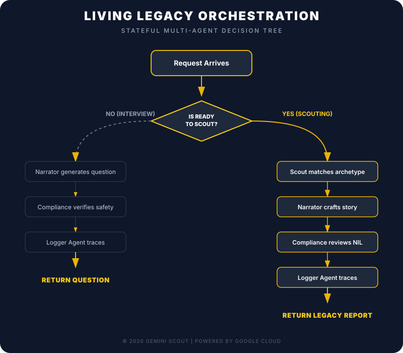

# Living Legacy: Multi-Agent Architecture



This document describes the current multi-agent pipeline. For the full history of architectural changes, see [`ARCHITECTURE_EVOLUTION.md`](ARCHITECTURE_EVOLUTION.md). For the Supervisor Agent removal decision, see [`supervisor_agent_postmortem.md`](supervisor_agent_postmortem.md).

---

## 1. Pipeline Orchestration

Mode selection is handled in Python (`streamer.py`), not by a routing LLM. Three distinct `SequentialAgent` pipelines cover every mode.

```
Request arrives at FastAPI /scout
  │
  ├── is_ready_to_scout: false, target_game_year: null
  │     → INTERVIEW pipeline:
  │         narrator_agent → compliance_agent → [logger after each]
  │
  ├── is_ready_to_scout: false, target_game_year: <year>
  │     → TIME_TRAVEL_INTERVIEW pipeline:
  │         narrator_agent (era mode) → compliance_agent → [logger after each]
  │
  └── is_ready_to_scout: true
        → SCOUTING pipeline:
            scout_agent → narrator_agent → compliance_agent → eval_agent → [logger after each]
```

Each agent step emits a `trace` SSE event immediately on completion. The Logger agent then produces a human-readable intelligence trace line for the sidebar.

---

## 2. Agent Roles

| Agent | Specialty | Role in Pipeline |
|---|---|---|
| **Scout** | The Analyst | Euclidean distance matching across 14 archetype profiles. Resolves gender-specific adaptive pathway. Enforces dimension distinctness between standing and adaptive picks. |
| **Narrator** | The Voice | **INTERVIEW mode:** Asks 3–5 targeted questions with genuine biomechanical option forks. **SCOUTING mode:** Rewrites Scout output into personalized 2–4 paragraph narratives with Narrative Contrast between standing and adaptive. **TIME_TRAVEL mode:** Asks one era-bridging question informed by destination age and era history. |
| **Compliance** | The Guard | Silently enforces: NIL rules, IOC brand terminology, adaptive parity (rewrites thin adaptive verdicts to full depth). Never modifies locked fields. |
| **Eval** | The Assessor | Scores completed scouting results on 6 dimensions. Assessment only — never modifies output. Results appear in Judge's Vault and feed the benchmark evaluator. |
| **Logger** | The Reporter | Receives a context summary after each agent step and produces one human-readable trace line for the Intelligence Trace sidebar. Never goes through Compliance. |

---

## 3. System Headers

The streamer builds a system header block injected at the top of every agent's input. Headers communicate mode, biometrics, gender, era context, and conversation history.

```
[SYSTEM: MODE | SCOUTING]
[SYSTEM: BIOMETRIC_DATA | Height: 183cm | Weight: 78kg | Age: 28 | Gender: M]
[SYSTEM: TIME_TRAVEL | Destination: The 2032 Games | User age at destination: 26 | Life stage: Elite Peak]
[SYSTEM: AGE_OVERRIDE | 26 (at The 2032 Games)]
[SYSTEM: ERA_HISTORY]
  2028 Games: User focused on endurance training after knee recovery.
[END ERA_HISTORY]
[SYSTEM: CONVERSATION_HISTORY]
  USER: I train for distance running about 4 times a week...
  NARRATOR: {"type": "interview", ...}
[END CONVERSATION_HISTORY]
```

`AGE_OVERRIDE` is injected only during SCOUTING with `target_game_year` set. The Scout uses this age for `peak_range` alignment (Step 5) while using `BIOMETRIC_DATA` height/weight for centroid distance calculations.

---

## 4. Temporal Logic (Life Stage System)

The time travel timeline displays every Games year where the user would have been age 16–55. Each pill is colored by the user's life stage at that time.

| Life Stage | Age Range | Color | Scout Behavior |
|---|---|---|---|
| Rising Star | <20 | `#34d399` green | Profiles with peak_range starting early (Air Sculptor, Block Starter) preferred |
| Elite Peak | 20–32 | `#facc15` gold | Direct centroid matching, all profiles eligible |
| Veteran | 33–45 | `#60a5fa` blue | Profiles with extended peak_range preferred (Steady Hand, Long Haul, Road Machine) |
| Legacy | >45 | `#a78bfa` purple | Peak_range mismatch penalty applied for youth-oriented profiles |

---

## 5. Output Invariants

These fields are **locked** — set by Scout, copied verbatim through every downstream agent:

- `matched_profile_id` — integer profile identifier
- `matched_profile_name` — archetype name (e.g., "Long Haul")
- `pathway_standing` — exact string from `pathways.standing`
- `pathway_adaptive` — gender-resolved string from `pathways.adaptive_M` or `pathways.adaptive_F`

Only `scout_verdict` is rewritten — first by Narrator (personalization), then potentially by Compliance (violation correction).

---

## 6. SSE Event Types

Every pipeline step emits structured SSE events:

| Type | Emitted by | Content |
|---|---|---|
| `trace` | Streamer (after each agent step) | `{ agent, event, timestamp, detail }` |
| `interview` | Compliance (interview mode) | `{ type, feedback, question, options, ready_to_proceed }` |
| `result` | Streamer (scouting mode) | Compliance-approved array of two profile objects |
| `eval` | Streamer (after eval agent) | Eval scores across 6 dimensions |
| `error` | Streamer | `{ detail }` on pipeline failure |
