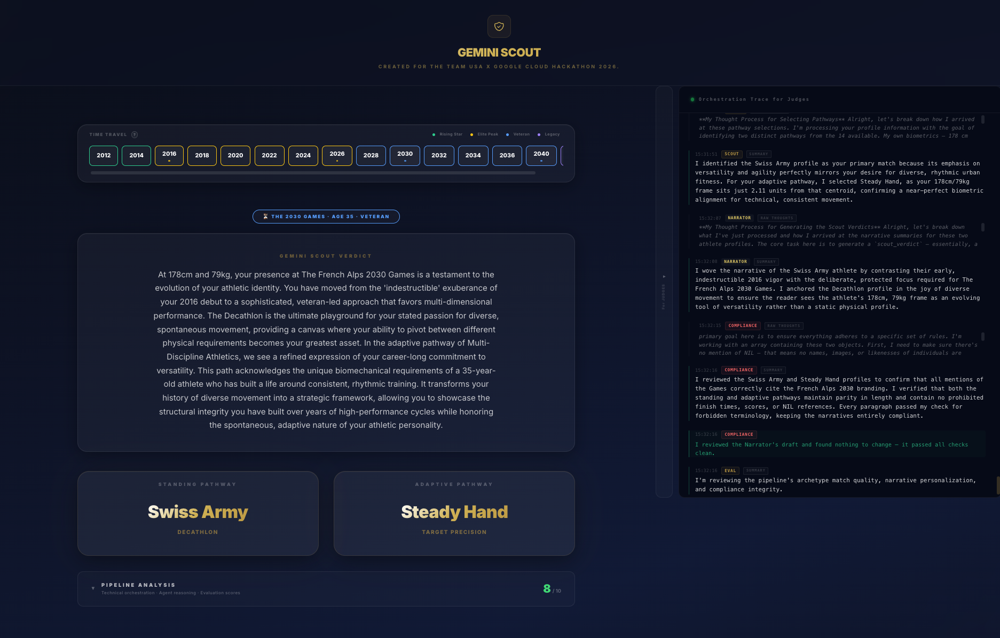

# Gemini Scout: The Living Legacy Journey

Gemini Scout is an immersive, multi-agent AI experience designed to map your unique movement profile to the legendary archetypes of Team USA. By bridging biometric data with personal narrative, it crafts a personalized "Living Legacy" across the Olympic and Paralympic timelines.

---

## Phase 1: The Gateway
The journey begins at the **Team USA Legacy Hub**. Here, the user is introduced to the mission: discovering their place in sporting history. The design is premium, leaning into the deep navy and gold aesthetic of Team USA, setting an elite tone from the very first click.

---

## Phase 2: Establishing the Baseline
Before the AI can scout, it needs the user's "Physical Legacy." Through a sleek, interactive slider interface, users lock in their height, weight, birth year, and gender. These metrics aren't just data points—they are the constraints the **Scout Agent** uses to find a biomechanical match in the official Pathway Manifest.

---

## Phase 3: The Narrative Exchange
This is where the magic of the **Sequential Agent Pipeline** comes to life. The **Narrator Agent** conducts a high-fidelity interview, asking probing questions about movement preferences and athletic drive. 

As the user answers, the **Intelligence Trace** sidebar (on the right) reveals the "Thinking" process of the agents in real-time, including silent reviews by the **Compliance Agent** to ensure every response stays on-brand and safe.

---

## Phase 4: The Revelation
Once the interview concludes, the system synthesizes a comprehensive **Scouting Report**. 
- **The Verdict:** A deep-dive narrative explaining *why* the user fits their archetypes.
- **The Archetypes:** Dual matches across Standing (Olympic) and Adaptive (Paralympic) pathways—in this case, the *Swiss Army* (Decathlon) and *Steady Hand* (Target Precision).
- **Time Travel:** A dynamic timeline allowing users to see how their potential shifts across different Games (e.g., from a "Rising Star" in 2012 to a "Veteran" in 2030).

---

## Phase 5: The Judge's Vault
For the technical observer, Gemini Scout offers ultimate transparency. The **Judge's Vault** (accessible by scrolling or expanding the report) provides a breakdown of the **Authenticator Score**. 

Powered by the **Eval Agent**, the system scores itself on Authenticity, Personalization, and Life Stage Coherence, ensuring that the "Living Legacy" isn't just a story, but a high-fidelity match backed by data.

---

## Summary of the Multi-Agent Flow
1. **Scout Agent:** Identifies the biometric match.
2. **Narrator Agent:** Orchestrates the interview and writes the prose.
3. **Compliance Agent:** Enforces brand guardrails and terminology.
4. **Logger Agent:** Translates agent thoughts into the Intelligence Trace.
5. **Eval Agent:** Performs the final quality benchmark.
